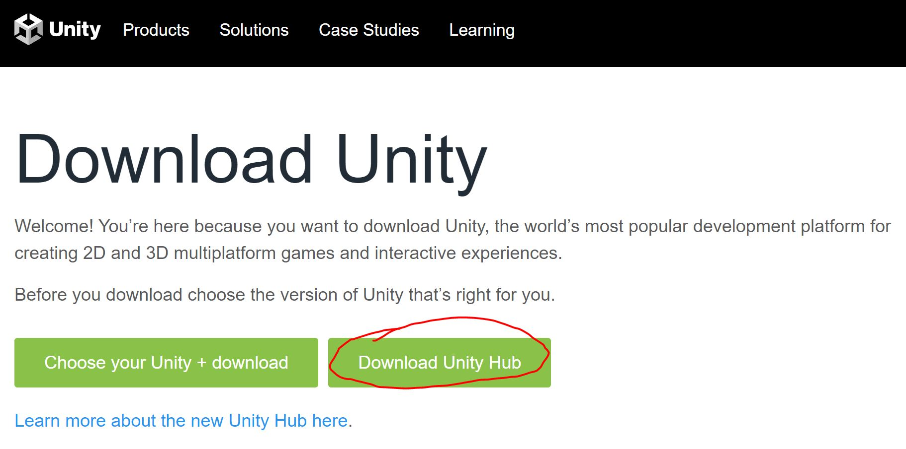
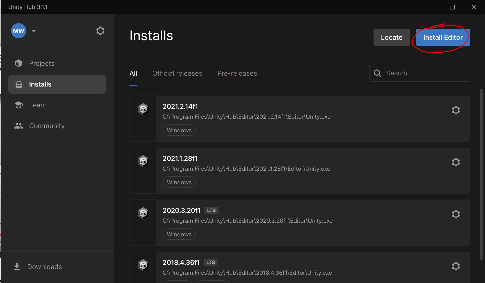

# Setting Up Unity

Now that git is set up, let's get your Unity working.

## Install Unity

1. Head over to Unity: [https://unity3d.com/get-unity/download](https://unity3d.com/get-unity/download).
2. Choose Unity Hub

3. Run Unity Hub and install our version of Unity Editor

