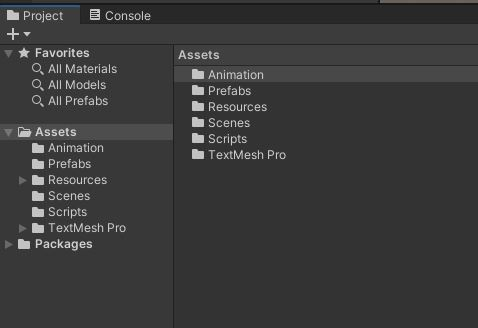
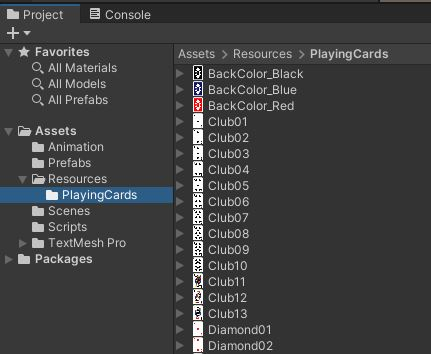

# Lab 01: Blackjack

A simple 2D card game for example: [Blackjack](https://youtu.be/yAPVQ8qyJ_w)

## Clone the Repo

This is the starting point for the project.
We will start off with an existing project.

{: .test}
Open your starting project in Unity.
There is one scene in the project. Assets/Scenes/Game.unity
Open the Game scene.
It should look like this...

{: .note }
You Are here

## Tour the Project

### Assets
In the Project tab, let's look at the Asset hierarchy. This is a fairly typical style of organization where we have folders for each type of asset.

### Card Sprites
Let's find the cards.
There is no "Sprites" folder. Instead, look in the "Resources" folder. In there, you will find the "Resources/PlayingCards" subfolder.

{: .note}
Since there are over 50 images in this folder, it's much easier to load these images using code.
If we want to load an asset, we should put it into the Resources folder.
We can **only** load files from a "Resources" or "StreamingAssets" folder.

### Scripting
There are 4 cs files (classes) in the "Scripts" folder.
**Card** is an individual card. This is the symbolic representation as well as the graphical sprite for the card.
**Deck** is the deck of unused cards. We will draw a card from the deck to place it into the player's **Hand**.
**Game** is a manager to run the flow of the game.
**Hand** is an individual player's hand (including the dealer). This is a collection of **Card**s.

## Do The Thing

## Commit and Push

Use your chosen git client to commit your changes.
Push your changes up to the server.

{: .note }
If you do not push your work, we cannot see it.
If we cannot see it, we cannot grade it, and we will be limited in how much advice we can offer.
Pushing your work saves everything as a backup.
Commit and Push Often.

## Check It

{: .test}
Test Goes Here

{: .warn}
Warnings go here

