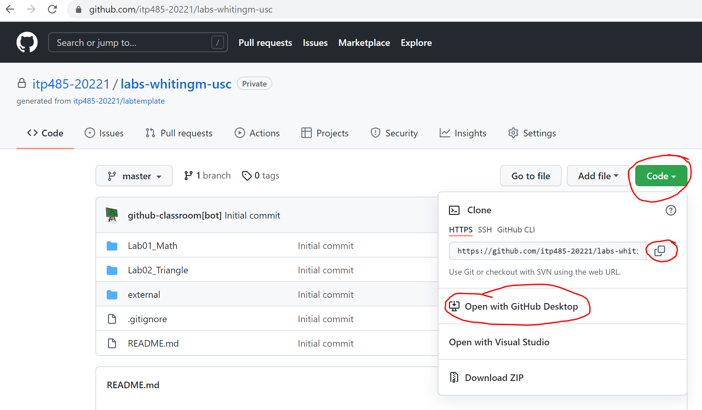
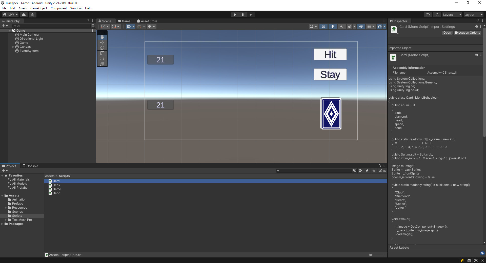

# Clone the Repo

This is the starting point for the project.\
We will start off with an existing project.

{: .test}
Open your starting project in Unity.\
There is one scene in the project. Assets/Scenes/Game.unity\
Open the Game scene.\
It should look like this...

