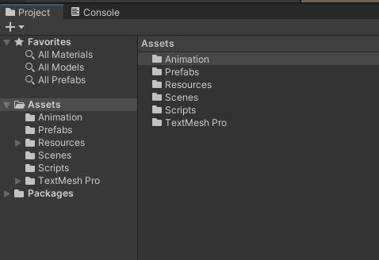
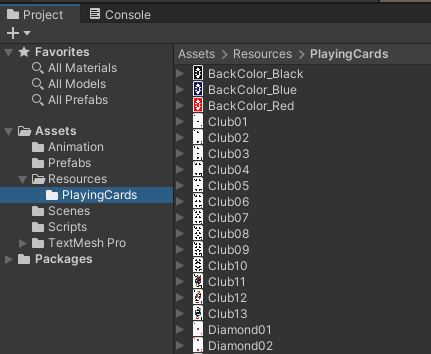
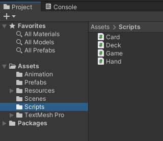
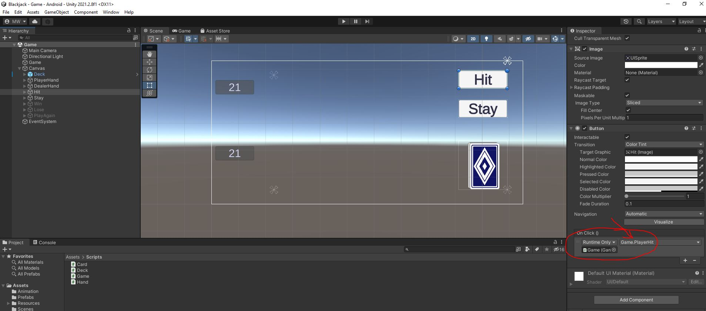

# Clone the Repo


This is the starting point for the project.\
We will start off with an existing project.

{: .test}
Open your starting project in Unity.\
There is one scene in the project. Assets/Scenes/Game.unity\
Open the Game scene.\
It should look like this...

{: .note }
You Are here

# Tour the Project

## Assets
In the Project tab, let's look at the Asset hierarchy. This is a fairly typical style of organization where we have folders for each type of asset.\


## Card Sprites
Let's find the cards.\
There is no "Sprites" folder. Instead, look in the "Resources" folder. In there, you will find the "Resources/PlayingCards" subfolder.\


{: .note}
Since there are over 50 images in this folder, it's much easier to load these images using code.\
If we want to load an asset, we should put it into the Resources folder.\
We can **only** load files from a "Resources" or "StreamingAssets" folder.

## Scripting
There are 4 cs files (classes) in the "Scripts" folder.\
\
**Card** is an individual card. This is the symbolic representation as well as the graphical sprite for the card.\
**Deck** is the deck of unused cards. We will draw a card from the deck to place it into the player's **Hand**.\
**Game** is a manager to run the flow of the game.\
**Hand** is an individual player's hand (including the dealer). This is a collection of **Card**s.

## Game.cs
Open up **Game.cs** and let's take a look.

### Variables
Let's start with the variables. I've placed those at the top.\
```
public class Game : MonoBehaviour
{
    public Hand m_playerHand;
    public TextMeshProUGUI m_playerScore;
    public Hand m_dealerHand;
    public TextMeshProUGUI m_dealerScore;
    public Deck m_deck;
    public GameObject m_hitButton;
    public GameObject m_stayButton;
    public GameObject m_win;
    public GameObject m_lose;
    public GameObject m_playAgain;

    int m_scorePlayer = 0;
    int m_scoreDealer = 0;
```
Those 'public' variables are automatically exposed in the Unity Editor.\
I have used these public variables to hook up all the various parts of the game such as the "Hit" button, the Player's **Hand**, and the **Deck**.

{: .note}
We use 'public' variables to expose things in the Unity Editor.

### Game Flow
The `Start()` function kicks things off with a coroutine. We'll talk more about those later.\
`StartCoroutine(DelayedDeal());`\
```
    IEnumerator DelayedDeal()
    {
        yield return new WaitForSecondsRealtime(0.1f);
        Deal();
    }

    void Deal()
    {
        m_playerHand.AddCard(m_deck.GetCard(), true);
        m_playerHand.AddCard(m_deck.GetCard(), true);
        UpdatePlayerScore();

        m_dealerHand.AddCard(m_deck.GetCard(), true);
        m_dealerHand.AddCard(m_deck.GetCard(), false);
        UpdateDealerScore();
    }
```
Simply put, we wait for 0.1 seconds and then call `Deal()`.\
The `Deal()` function puts 2 cards into the player's **Hand** and 2 cards into the dealer's **Hand**.\
\
Then, it just waits. Wait's for what?\
\
It is now the player's turn to take an action. The player may either "Hit" or "Stay". There are functions set up for those actions:\
```
    public void PlayerHit()
    {
        m_playerHand.AddCard(m_deck.GetCard(), true);
        int score = UpdatePlayerScore();
        if (score > 21)
            PlayerStay();
    }

    public void PlayerStay()
    {
        m_hitButton.SetActive(false);   // disable the "Hit" button
        m_stayButton.SetActive(false);   // disable the "Stay" button too
        m_dealerHand.RevealAll();
        m_dealerScore.transform.parent.gameObject.SetActive(true);
        StartCoroutine(DealerTurn());
    }
```
This leaves us with the question, "How are these functions going to get called?"

### Look at the Scene
\
Select the "Hit" button.\
Scroll down a bit in the "Inspector" tab to find the "On Click" section of the "Button" component.
