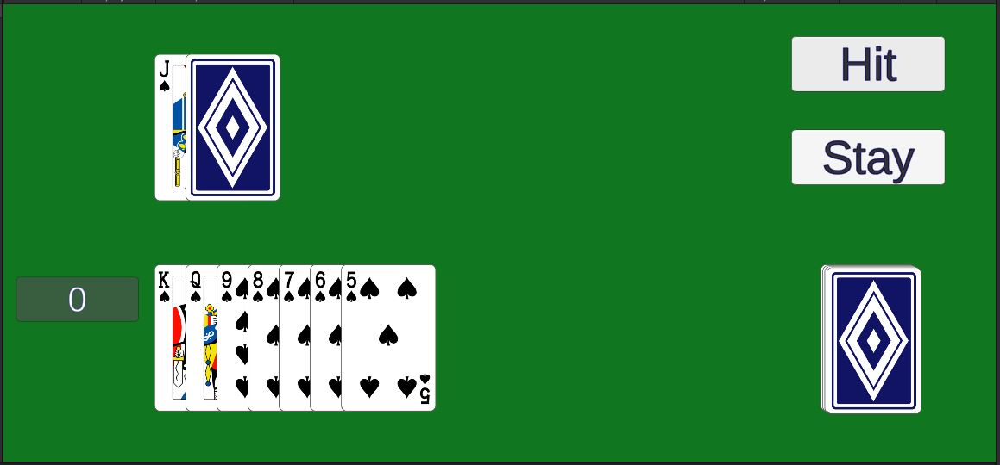

# Deck.GetCard()
In the class *Deck*, fill out the function *GetCard()*.
```
    public Card GetCard()
    {
        Card card = null;
        // TODO take the next card if there is one
        
        if (m_cards.Count <= 0)
        {   // if we're out of cards, gray out the deck image
            Image image = GetComponent<Image>();
            image.color = new Color(0.1f, 0.1f, 0.1f, 0.5f);
        }
        return card;
    }
```
* If there are no *Card*s left in the `m_card` List, `card` should return `null`.
* Otherwise, remove one `card` from the List `m_card`.
* Use `SetActive` to activate that `card`'s `GameObject`.
* Return that.

# Game.PlayerHit()
In the class *Game*, fill in the function *PlayerHit()*.
```
    public void PlayerHit()
    {
        // TODO call GetCard() to get the next card from the deck and add it to the player's hand
        // call UpdatePlayerScore() to recalculate the player's score
        // if the player busts (score > 21), call PlayerStay()
    }
```
* Call `GetCard` on the *Deck* to get a *Card*.
* Add that *Card* to the player's *Hand*.
* Call `UpdatePlayerScore` to calculate the player's new score.
* If the player busts (score exceeds 21), call `PlayerStay` to end the player's turn.

{: .test}
Try it out. Hit Play In Editor.\
You should be able to deal cards now.\
You'll notice that the cards are in order, and the score doesn't work yet.
