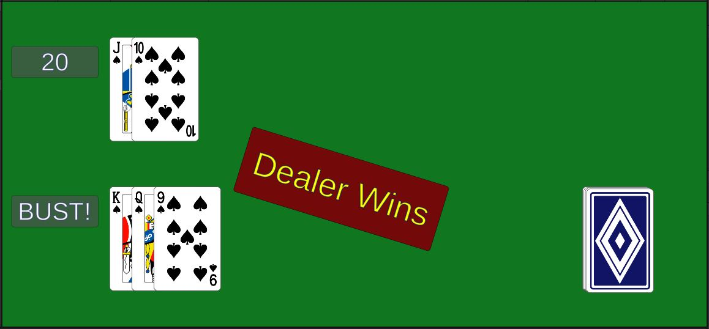

# Hand.Score()
In the class **Hand**, fill out the function `Score()`.
```
    public int Score()
    {
        // TODO calculate the score
        return 0;
    }
```
* Each card from 2 through 10 is worth the value of that number.
* Each "face card" (jack, queen, and king) are worth 10 points each.
* Aces are either worth 1 or 11 points. Use 11 points unless that would put you over 21 - then use 1.
* Return the total score.

{: .test}
Now when you play it, the score should work.\
If you've sorted it the way I have, you'll bust if you hit at all.\
(You don't have to sort it my way.)

{: .note}
Going bust won't end the player's turn yet.\
You programmed it to call `PlayerStay()`, but we haven't implemented that yet.\
Let's get on that.

# Game.PlayerStay()
In the class **Game**, fill in the function `PlayerStay()`.
```
    public void PlayerStay()
    {
        // TODO deactivate the hit button
        // deactivate the stay button
        // call RevealAll() to reveal the dealer's hand
        // activate the dealer's score display
        // start DealerTurn() as a coroutine
    }
```
The player's turn is over, so let's disable the player's buttons and let the dealer take their turn.
* Use `GameObject.SetActive` to deactive the hit button.
* Use `GameObject.SetActive` to deactive the stay button.
* Reveal the dealer's cards with a call to `RevealAll`
* Reveal the dealer's score with a call to `GameObject.SetActive`
* Use `StartCoroutine` to start `DealerTurn()`.

{: .test}
You Are Here!
