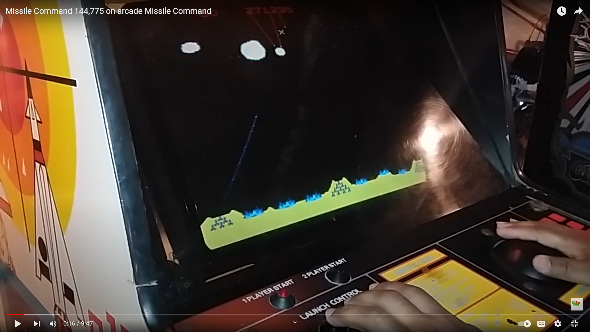
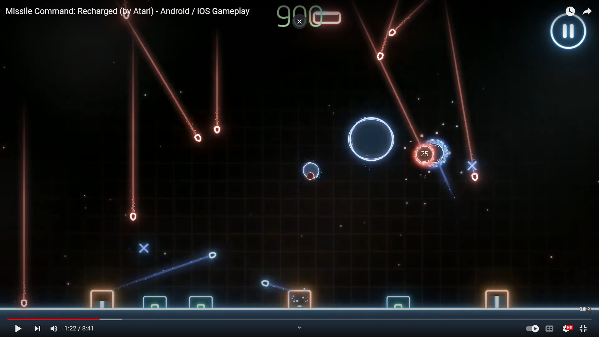

# Lab 03: MissileCommand
Missile Command was an old Arcade game by Atari from 1980\
\
It was based on a trackball controller, but the game mechanic lends itself easily to touch controls.\
Here's what it might be like on mobile\
\
[Missile Command: Recharged on Google Play](https://play.google.com/store/apps/details?id=com.atari.mobile.missilecommandmc&hl=en_US&gl=US)\
[Missile Command: Recharged on App Store](https://apps.apple.com/us/app/missile-command-recharged/id1494023721)

