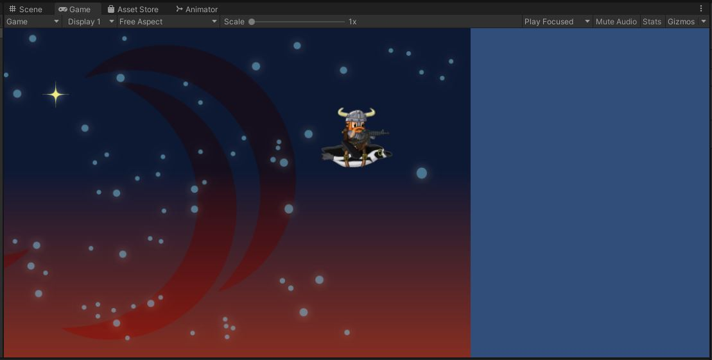

# Forced Scrolling
Head over the the PlayerBird.cs class.
```
public class PlayerBird : Bird
{
    public float m_forwardSpeed = 3.0f;

    // Update is called once per frame
    protected override void Update()
    {
        m_flap = Input.GetMouseButtonDown(0) || Input.GetKeyDown(KeyCode.Space);
        m_glide = m_flap || Input.GetMouseButton(0) || Input.GetKey(KeyCode.Space);

        {   // TODO Move the player bird forward at a rate of m_forwardSpeed (units per second)
        }

        base.Update();
    }
}
```
I've already set up the `m_flap` and `m_glide` inputs.\
What is left for you to do is to force the player to move forward.\
I haven't set up any input for this... let's just move the player's transform directly.

{: .test}
Play In Editor.\
The player sprite should move forward.\
You can press space to flap and control your up and down.\
Because the camera automatically follows the player, the player sprite stays centered on screen.
Instead, you'll see the background scrolling past.\
In fact, the background quickly scrolls off screen.


