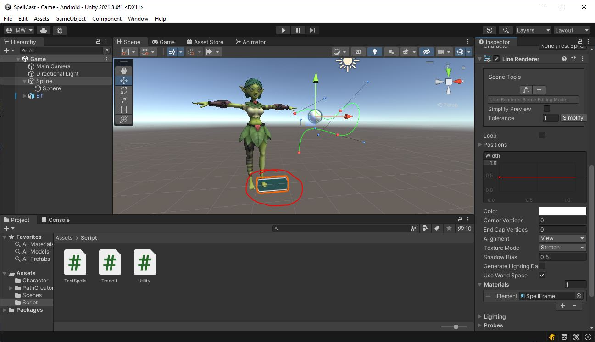

# Spline
The game is managed via the **GameObject** labeled "Spline".\
Let's take a look at what we've got on here.

## LineRenderer
Down at the bottom of the Inspector list, you'll see there is a **LineRenderer** on here.

At this point, it just looks like a little rectangle.\
At runtime, the **LineRenderer** will be updated to follow the curve of the **PathCreator** (see below)
