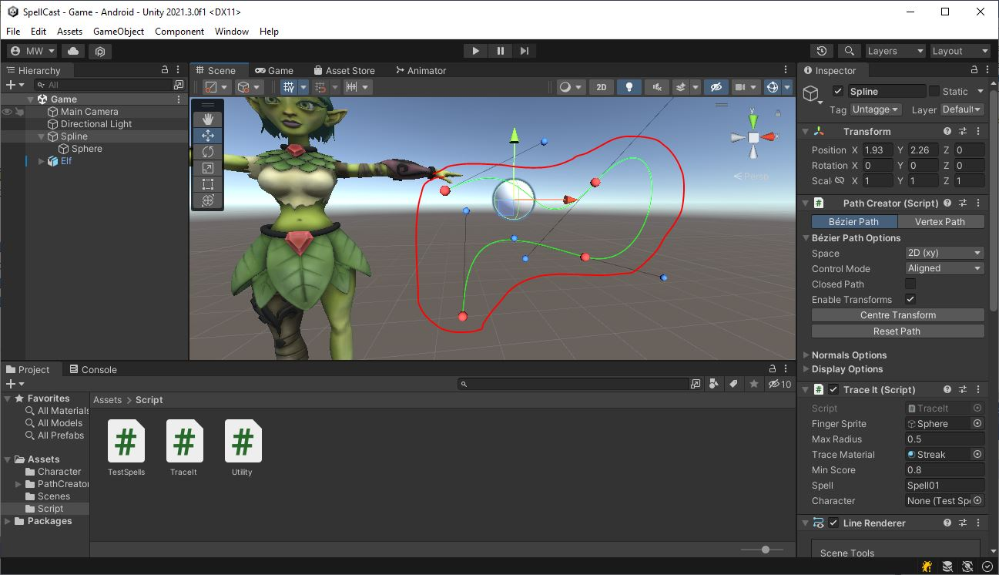

# Spline
The game is managed via the **GameObject** labeled "Spline".\
Let's take a look at what we've got on here.

## LineRenderer
Down at the bottom of the Inspector list, you'll see there is a **LineRenderer** on here.

At this point, it just looks like a little rectangle.\
At runtime, the **LineRenderer** will be updated to follow the curve of the **PathCreator** (see below)

## PathCreator
Unity doesn't come with any spline-based features built in.\
I'm not a big fan of using plugins, but in this case, we'll make an exception.\
[Bezier Path Creator](https://assetstore.unity.com/packages/tools/utilities/b-zier-path-creator-136082#content)
is free on the asset store, and it provides a very accessible tool for editing Bezier splines.\
I've used it to create a curved path for the finger trace.

## TraceIt
This is where the action is going to happen, but if you look at it now, you'll see it's almost entirely empty.

