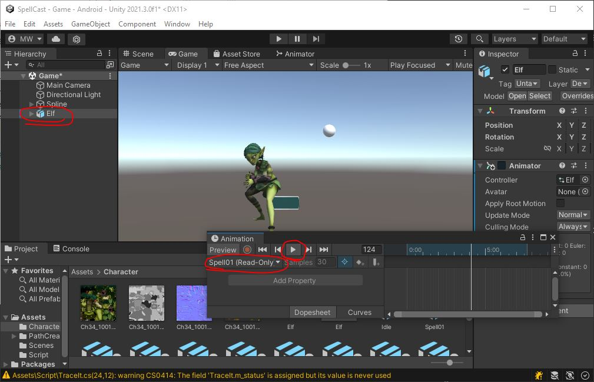
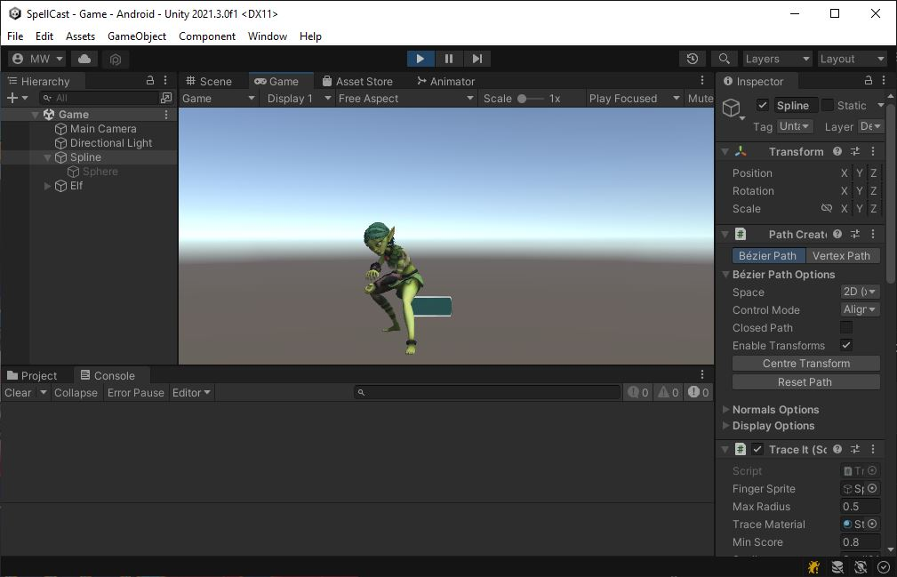

# Animations

{: .todo}
* Select **GameObject** "Elf" in the scene
* Open the Animation window
	* Create the Animator and the clip
	* We really just need the Animator, so delete the clip you just created
	* There are several animations in the "Assets/Character" folder. Drag the following animation files into the Animator:
		* "Assets/Character/Idle.fbx"
		* "Assets/Character/Spell01.fbx"
		* "Assets/Character/Spell02.fbx"
		* "Assets/Character/Spell03.fbx"

{: .test}
Select the "Elf" in the scene.\
Bring the "Game" tab to the front so you can see the elf.\
Bring up the "Animation" window.\
Select each of your animations and hit the play button to verify they work.


# Animation Transitions

{: .todo
* Open up your Animator "Assets/Character/Elf.controller"
* Make sure "Idle" is the default state
* Make transitions from "Idle" to each of the "Spell" animations and back again
Let's use *Triggers* to trigger the spell animations, and they'll automatically return to "Idle" at the end.
* Go to the "Parameters" tab
* Add *Trigger*s called "Spell01", "Spell02", and "Spell03"
* Make the transition from "Idle" to "Spell01" happen on the *Trigger* "Spell01"
	* Turn off "Has Exit Time" for this transition
* Make the transition from "Idle" to "Spell02" happen on the *Trigger* "Spell02"
	* Turn off "Has Exit Time" for this transition
* Make the transition from "Idle" to "Spell03" happen on the *Trigger* "Spell03"
	* Turn off "Has Exit Time" for this transition
}

# Testing The Animations
Look at "TestSpells.cs"
```
public class TestSpells : MonoBehaviour
{
    Animator m_anim;

    // Start is called before the first frame update
    void Start()
    {
        {   // TODO get the Animator component and remember that as m_anim
        }
    }

    // Update is called once per frame
    void Update()
    {
        {   // TODO use KeyCode.Alpha1 to trigger the first spell
            // use KeyCode.Alpha2 to trigger the second spell
            // use KeyCode.Alpha3 to trigger the third spell
        }
    }

    public void CastSpell(string spell, float power)
    {
        {   // TODO Trigger the specified "spell"
            // note: we're not using "power" at this point
        }
    }
}
```
## Start()
{: .todo}
* Use `GetComponent<>()` to find the **Animator** and save that as `m_anim`

## Update()
{: .todo}
* Use `Input.GetkeyDown()` to detect leading edges from the keyboard
	* on Alpha1, *Trigger* "Spell01"
	* on Alpha2, *Trigger* "Spell02"
	* on Alpha3, *Trigger* "Spell03"

{: .note}
`KeyCode.Alpha1` is the "1" key on the keyboard.\
This will only work on the PC.\
We're only doing this for debugging purposes, so we don't need it to work on mobile devices.

## CastSpell()
{: .todo}
* Trigger the `spell`

## Hook It Up
{: .todo}
* Put a "Assets/Script/TestSpells.cs" script onto the "Elf" object in the scene
* The "Spline" object has a **TraceIt** component on it with a slot for `m_character`
	* Point that to our "Elf" object which now has the **TestSpells** on it

{: .test}
Play In Editor.\
You should see the "Idle" anim playing in a loop.\
Press the "1" key and verify that the "Spell01" animation plays once and then returns to "Idle".\
Check that the "2" and "3" keys work as well.


{: .warn}
Let's commit and push it.

