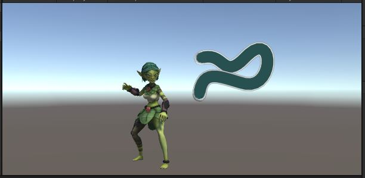

# TraceIt.cs
We've got quite a lot to do in this class.
```
public class TraceIt : MonoBehaviour
{
    public GameObject m_fingerSprite;
    public float m_maxRadius = 0.5f;
    public Material m_traceMaterial;
    public float m_minScore = 0.8f;
    public string m_spell = "Spell01";
    public TestSpells m_character;

    PathCreator m_path;
    LineRenderer m_line;
    LineRenderer m_traceLine;

    enum Status
    {
        WAIT,
        TRACING
    }
    Status m_status;
    Keyframe[] m_traceFrames;

    // Start is called before the first frame update
    void Start()
    {
        {   // TODO get the PathCreator as "m_path"
            // Get the LineRenderer as "m_line"
        }

        {   // TODO change m_line to have the same number of points as m_path
            // Set the position of each of m_line's points to the matching point in m_path (use PathCreator.path.GetPath())
        }
        {   // TODO make a new object as a child of this one
            // duplicate your line as a child object.
            // add a LineRenderer component to it.
            // copy all the positions for the new LineRenderer from m_line only moved forward by 0.01f units (negative z)
        }
        {   // TODO create an array of Keyframe - one for each point (m_path.path.NumPoints)
            // Fill each one with time going from 0.0f to 1.0f and value 0.0f for all
            // Set m_traceLine.widthCurve to a new AnimationCurve based on m_traceFrames
        }

        m_status = Status.WAIT;
        m_fingerSprite.SetActive(false);
    }

    void Update()
    {
        {   // TODO on left mouse button down (which doubles as first finger touch)
            // enable the "m_fingerSprite"
            // set the "m_status" to Status.TRACING
            // reset all the "m_traceFrames" to 0.0f
        }
        {   // TODO on left mouse button up (first finger lift)
            // call Release()
        }
        {   // TODO if the left mouse button is held (doubles as finger on screen)
            // convert the mouse (finger) position from screen to world coords with Utility.ScreenToWorldPos()
            // use that to find out where on m_path the finger seems to be closest
            // place "m_fingerSprite" on the path at the point nearest the finger
            // if the finger is too far away from the path (more than "m_maxRadius"), call Release() to end the spell-cast
            // if the finger has reached the end of the path, call Release() to end the spell-cast
            // give the finger position a from 0-1 based on the distance from the path. 1.0f for 0 distance and 0.0f for "m_maxRadius" away
            // put that position score into "m_traceFrames" at the appropriate spot
            // update "m_traceLine.widthCurve" with the latest "m_traceFrames" to draw the trace
        }
    }

    void Release()
    {
        {   // TODO if "m_status" was "Status.TRACING":
            // hide the "m_fingreSprite",
            // set "m_status" back to "Status.WAIT",
            // Calculate the player's score with Score(), and
            // if score is at least "m_minScore", call CastSpell() on the "m_character"
        }
    }

    float Score()
    {
        float score = 0.0f;
        {   // TODO go through all the per-point scores in "m_traceFrames"
            // Combine them to come up with an overall score in the range of 0.0f to 1.0f and return the score
        }
        return score;
    }
}
```

# Start()

{: .todo}
* In the first **TODO**
    * Use `GetComponent<>()` to find the **PathCreator** and save that as `m_path`
    * Use `GetComponent<>()` to find the **LineRenderer** and save that as `m_line`
* In the second **TODO**
    * Make the **LineRenderer** (`m_line`) have the same number of points as **PathCreator** (`m_path.path.NumPoints`)
    * Copy the position of each point from `m_path` into `m_line` (use `m_path.path.GetPoint()`)

{: .test}
Play In Editor.\
You should see a nice outline of the path to trace.


# Make a Copy of the LineRenderer

{: .todo}
* Find the third **TODO** in `Start()`
* Make a new object as a child of the "Elf" object (this **GameObject**)
    * Call your new **GameObject** "trace"
* Add a **LineRenderer** component to your new **GameObject**
    * Save the new **LineRenderer** in the member variable `m_traceLine`
* Set the `material` for your new **LineRenderer** to `m_traceMaterial`
* Copy all the positions for the new **LineRenderer** from `m_line` only moved forward by 0.01f units (negative z)

{: .test}
Play In Editor.\
The glowy overlay is what we're going to use to indicate successful finger tracing.


# Control the Line Width
The glowy bit is supposed to show where we've traced, and maybe how well we've done with that.\
But for now, it's just a giant blob.\
The plan is to adjust the width of the **LineRenderer** at each point so the line fills in where we've traced.

## Create the trace
Find the fourth **TODO** in `TraceIt.Start()`
```
        {   // TODO create an array of Keyframe - one for each point (m_path.path.NumPoints)
            // Fill each one with time going from 0.0f to 1.0f and value 0.0f for all
            // Set m_traceLine.widthCurve to a new AnimationCurve based on m_traceFrames
        }
```

{: .todo}
* Set `m_traceFrames to a new array of **Keyframe**s
    * one for each point (m_path.path.NumPoints)
* Fill each one with time going from 0.0f to 1.0f
    * the first one has a time of 0.0f
    * each one after that has a larger value
    * until the last **Keyframe** has a time value of 1.0f
* And set each one's value to the same as the time
* Set `m_traceLine.widthCurve` to a new **AnimationCurve** based on `m_traceFrames`

{: .test}
If you've set it up right, it should now look like this with the glowy line starting out thin and reaching maximum thickness at the end.

Notice that you can inspect the width of the **LineRenderer** and see the curve you created.

{: .warn}
Now's a good time to commit and push... just in case.


