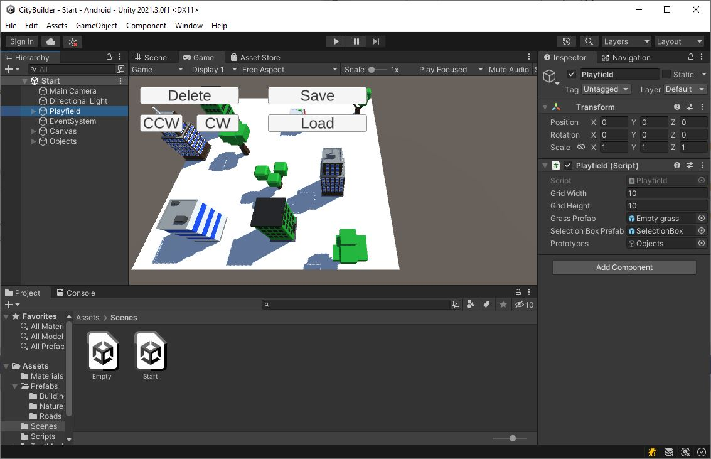
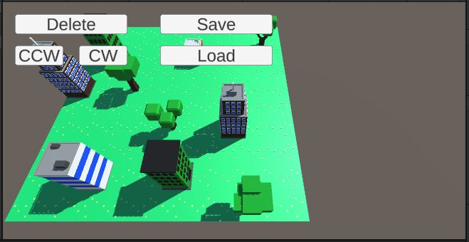

# Accept the Assignment
**TODO** [Accept the Assignment](https://classroom.github.com/a/PIcAUCif)

# Clone the Repo
This is the starting point for the project.\
We will start off with an existing project.

{: .test}
**TODO** Open your starting project in Unity.\
There is just the one scene "Assets/Scenes/Game.unity"

{: .test}
**TODO** Unlike most of our labs, this one starts off fully playable.

