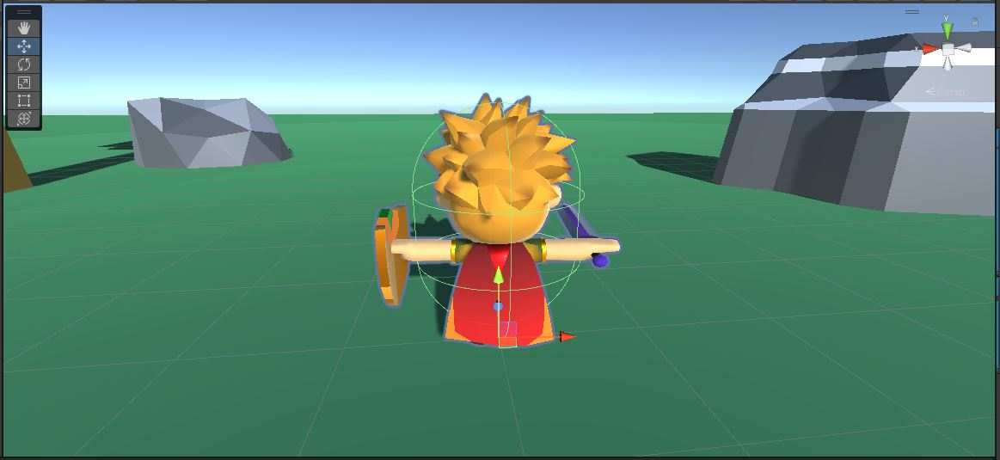

# Walking.cs
Let's start by making the character simply walk around.

{: .todo}
* Put a CharacterController (standard Unity CharacterController) on the "Player"
* Adjust the Character's Capsule to more-or-less match the graphics
	* Be sure that the bottom of the capsule is above the ground a little

* Create a new script called "Character.cs" and attach one to the "Player"
	* Give it the following public variables:
```
public float m_walkSpeed = 2.0f;
public float m_turnSpeed = 360.0f;  // degrees per second
public Joystick m_joystick;
```
	* In your `Start()`, get the attached **CharacterController** and store that in a member variable
	* In `Update()`, let's start by just making the character move forward
	* Call `CharacterController.Move()` to move the player forward at a rate of `m_walkSpeed` units per second
		* don't forget Time.deltaTime

{: .test}
When you Play In Editor, you should see the character moving forward at a steady rate.

{: .todo}
next

