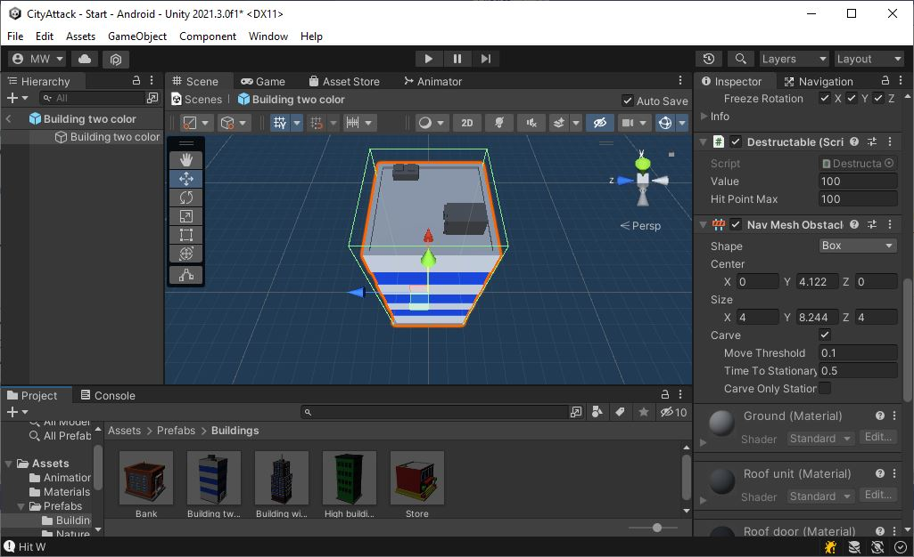
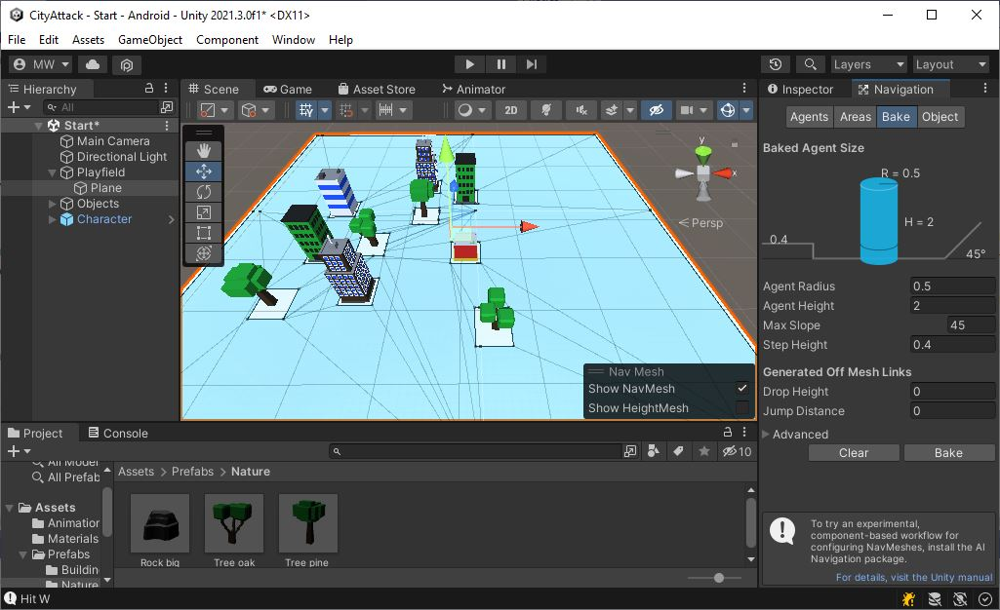

# NavMesh
Let's set up the navigation mesh.

{: .todo}
* Select object "Playfield/Plane"
* Open the Navigation window
* Hit "Bake"

# NavMeshObstacle
Our NPCs need to navigate around the buildings.

{: .todo}
* Add a **NavMeshObstacle** component to each of the buildings and the trees
	* Mark the "Carve" checkbox
	* Un-mark the "Carve Only Stationary" box
	* Don't do the roads. We don't want NPCs to avoid roads

* You may need to re-bake the **NavMesh** on "Playfield/Plane"

{: .test}
It should look like this now:

# YOU ARE HERE

